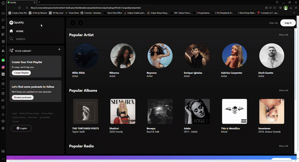

# 🎧 Spotify Clone Web Page

This project is a **Spotify Clone** web page built using HTML and CSS. It replicates the look and feel of the popular music streaming service, providing a similar user experience with a sleek and modern interface. The project focuses on enhancing your frontend development skills, particularly in layout design and responsive web development.

## 🚀 Features

- **Home Page**: A landing page featuring popular playlists, new releases, and recommendations.
- **Search Functionality**: A mockup of Spotify’s search bar that allows users to find their favorite songs or artists.
- **Playlist Page**: Displays a list of tracks within a selected playlist, including album art and track details.
- **Responsive Design**: Fully responsive design optimized for mobile, tablet, and desktop views.
- **Navigation Bar**: A fixed sidebar for easy navigation between different sections of the app.

## 🛠️ Technologies Used

- **HTML5**: Used to structure the content of the web page.
- **CSS3**: Used for styling and layout.
  - **Flexbox** for a flexible and responsive layout.
  - **Grid Layout** for complex, grid-based designs.
  - **Media Queries** to ensure a responsive design across various screen sizes.
- **Font Awesome**: Used for icons, such as the play button, shuffle, and volume controls.
- **Google Fonts**: Custom fonts to closely match Spotify's design style.

# 🤩 Preview:
# Spotify_Clone
